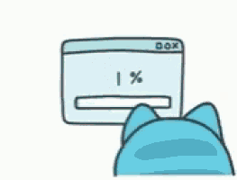

# TenorGifs - Automated GIF Generator for Transcripts

TenorGifs is a Python tool that automatically generates relevant GIFs from video transcriptions. It reads JSON transcript files, searches Tenor for relevant GIFs based on the transcribed text, and creates optimized GIF files that match the content.

<p align="center">
  
  
  
</p>

## 🌟 Features

- Automatically extract keywords from transcriptions
- Search Tenor API for relevant GIFs
- Download, trim, and resize GIFs to target resolution
- Merge multiple GIFs for varied visual content
- Create letterboxed GIFs to maintain aspect ratio within target dimensions
- Optimize GIF durations for better viewing experience

## 📋 Requirements

- Python 3.6+
- Pillow (PIL fork)
- Requests

## 🔧 Installation

1. Clone this repository:
   ```bash
   git clone https://github.com/yourusername/TenorGifs.git
   cd TenorGifs
   ```

2. Install required dependencies:
   ```bash
   pip install pillow requests
   ```

3. Get a Tenor API key (see below)

## 🔑 Obtaining a Tenor API Key

To use this tool, you'll need to obtain a Tenor API key:

1. Visit the [Google Cloud Console](https://console.cloud.google.com/)
2. Create a new project (or use an existing one)
3. Enable the "Tenor API" for your project
4. Navigate to "Credentials" and create an API key
5. Make sure to restrict the API key to only the Tenor API for security

For detailed instructions, follow the [Tenor API Documentation Quickstart](https://tenor.com/gifapi/documentation#quickstart-share)

## 📂 Project Structure

```
TenorGifs/
├── main.py            # Main script for processing transcriptions
├── transcriptions.json # Input transcription file (example)
└── output/            # Directory where generated GIFs are saved
```

## 📝 Input Format

The script expects a JSON file with transcriptions in the following format:

```json
[
  {
    "timestamp": "00:00:15",
    "words": ["hello", "world", "example", "phrase"]
  },
  {
    "timestamp": "00:00:30",
    "words": ["another", "example", "sentence"]
  }
]
```

## 🚀 Usage

1. Set your Tenor API key in the script:
   ```python
   tenor_api_key = "YOUR_API_KEY_HERE"
   ```

2. Prepare your transcription file in the required JSON format

3. Run the script:
   ```bash
   python main.py
   ```

4. Check the `output` directory for your generated GIFs


## ⚙️ Configuration Options

You can modify these variables in the script to customize the behavior:

- `target_resolution`: Set the output GIF dimensions (default: 320×240)
- `max_duration`: Maximum duration for each trimmed GIF in milliseconds (default: 2000ms)
- `max_total`: Maximum total duration for final GIFs in milliseconds (default: 4000ms)

## 📺 Applications

- Create visual aids for presentations
- Generate content for social media
- Enhance educational materials
- Create visual commentaries for videos

## ⚠️ Limitations

- The free tier of Tenor API has daily usage limits
- GIF quality depends on available content in Tenor's database
- Processing large transcription files may take time

## 🔄 Future Improvements

- Add support for YouTube API to directly extract transcriptions
- Implement better keyword extraction algorithms
- Add a GUI for easier configuration
- Support batch processing of multiple transcription files

## 📄 License

[MIT License](LICENSE)

## 🙏 Acknowledgements

- [Tenor API](https://tenor.com/gifapi/) for providing GIF search capabilities
- [Pillow](https://python-pillow.org/) for image processing capabilities